# Object Diagrams Documentation

## Guest Active Reservation Scenario
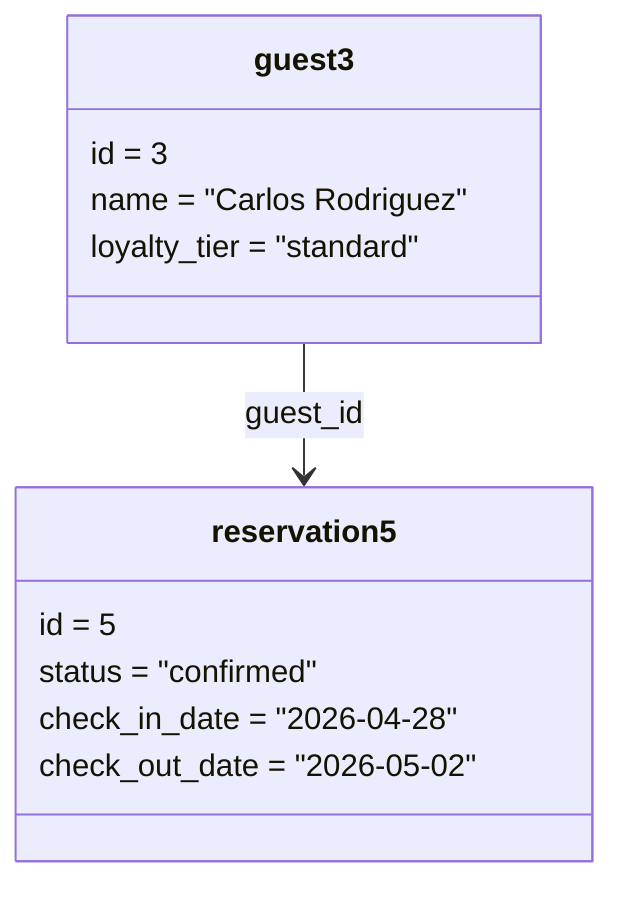

## Room Assignment Checked-In Scenario
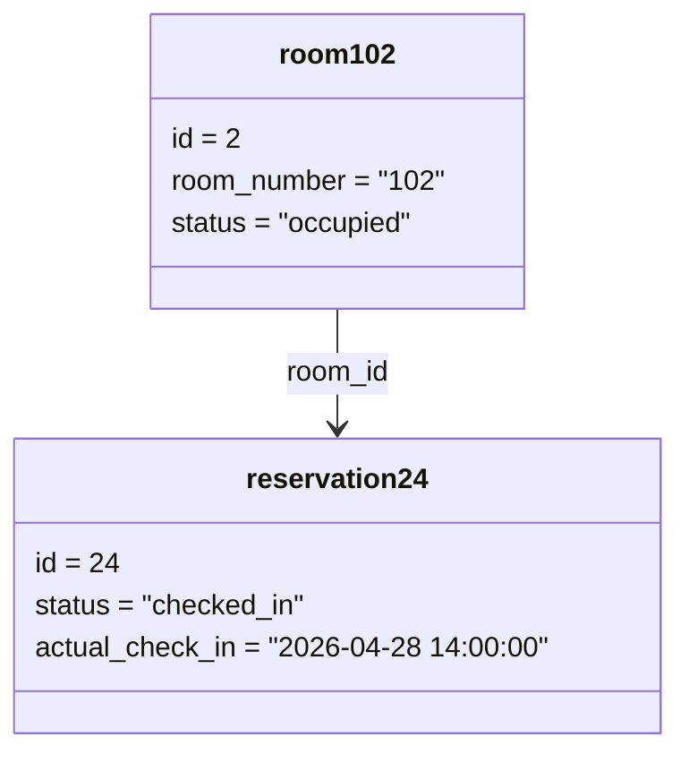

## Reservation to Folio Scenario
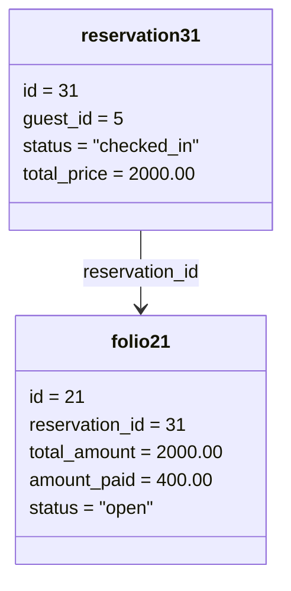

## Folio Charge Posting Scenario
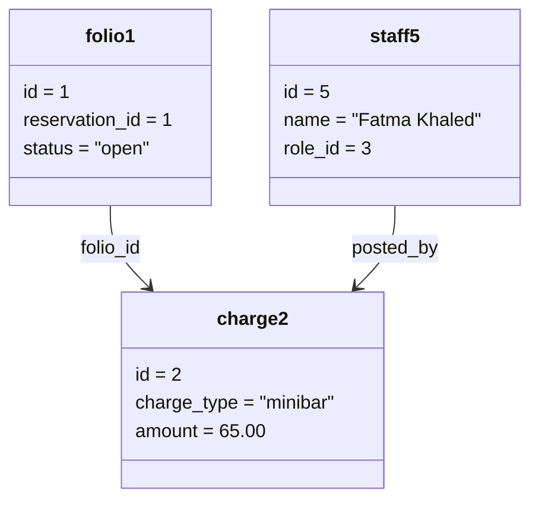

## Payment Processing Scenario
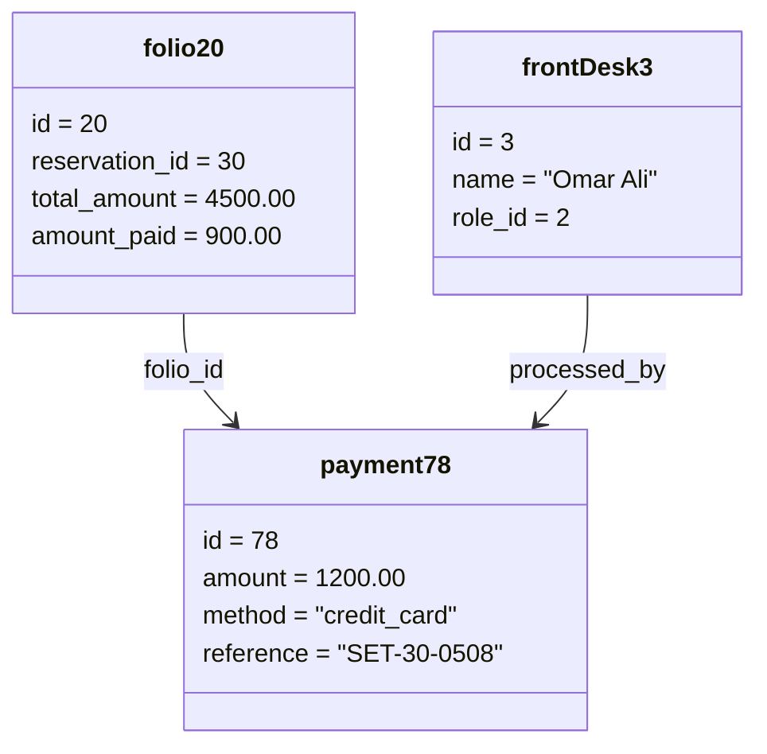

## Group Reservation Billing Scenario
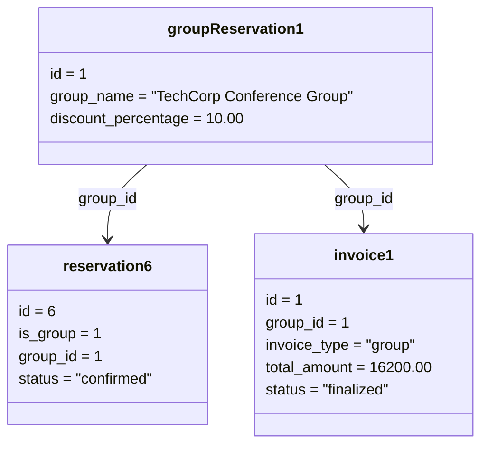

## Corporate Guest Mapping Scenario
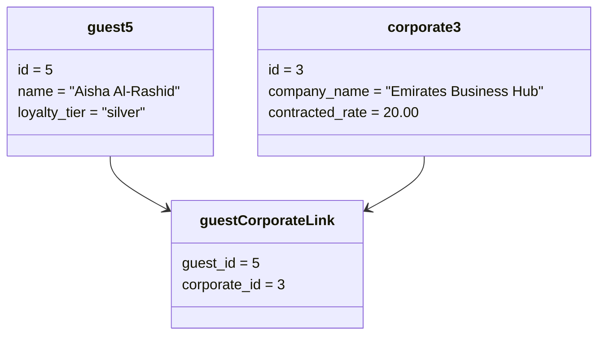

## Guest Preference Personalization Scenario
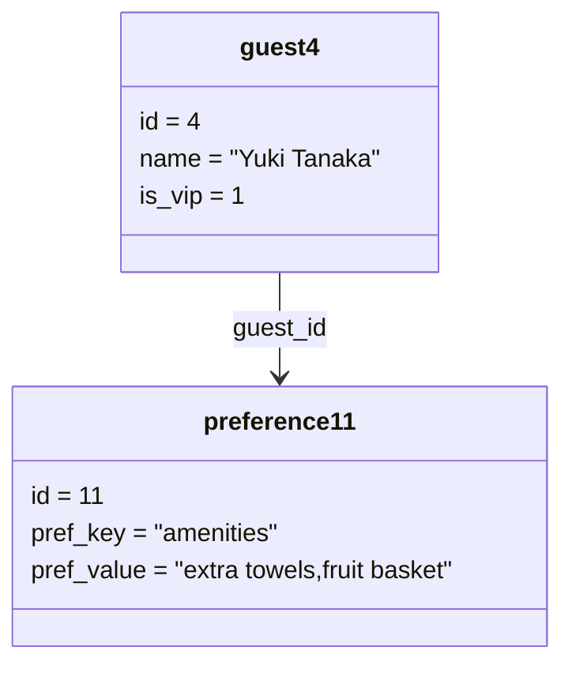

## External Service Booking Scenario
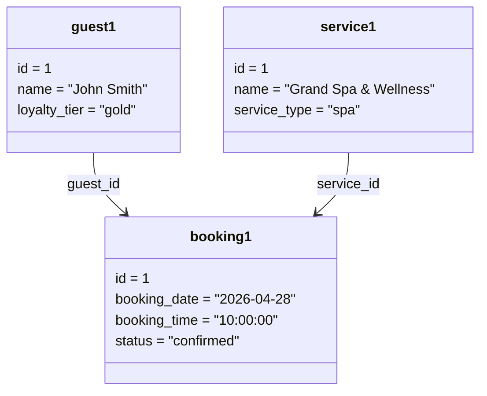

## Housekeeping Task Assignment Scenario
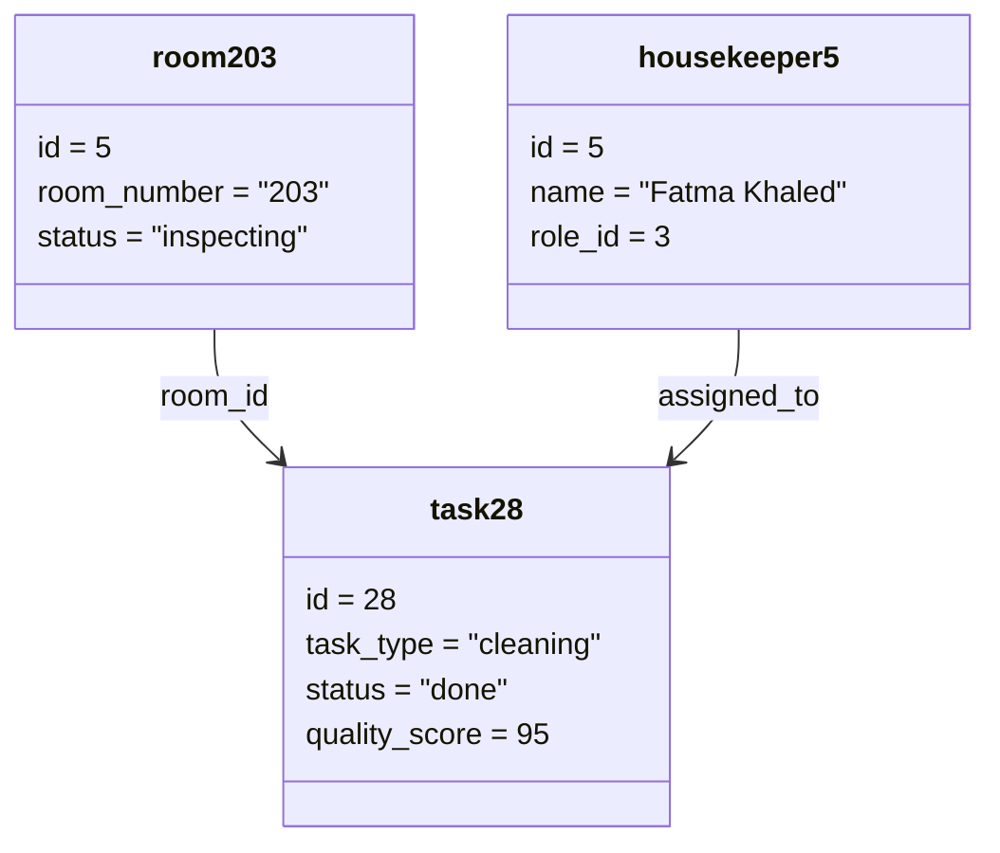

## Maintenance Emergency Work Order Scenario
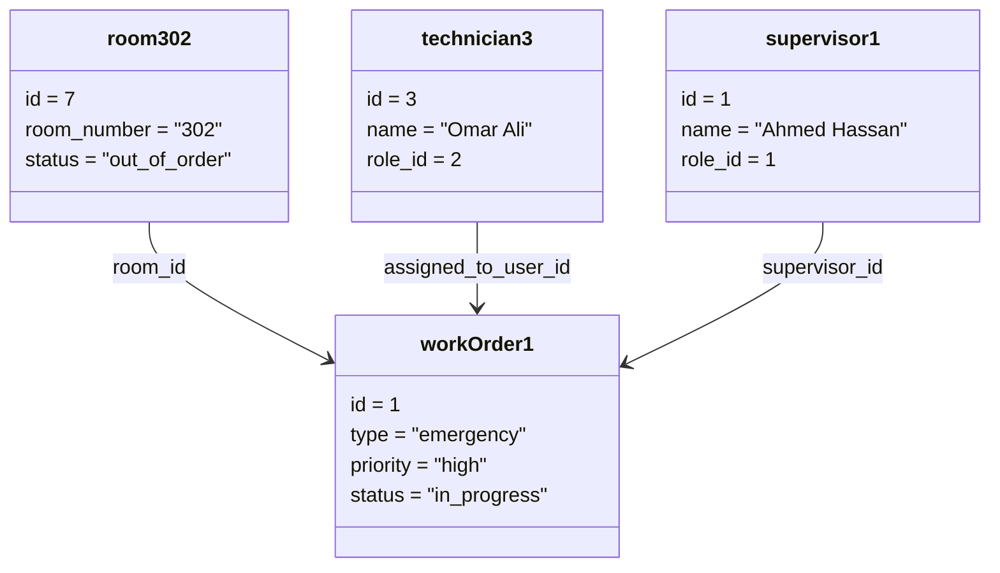

## Lost and Found Claim Scenario
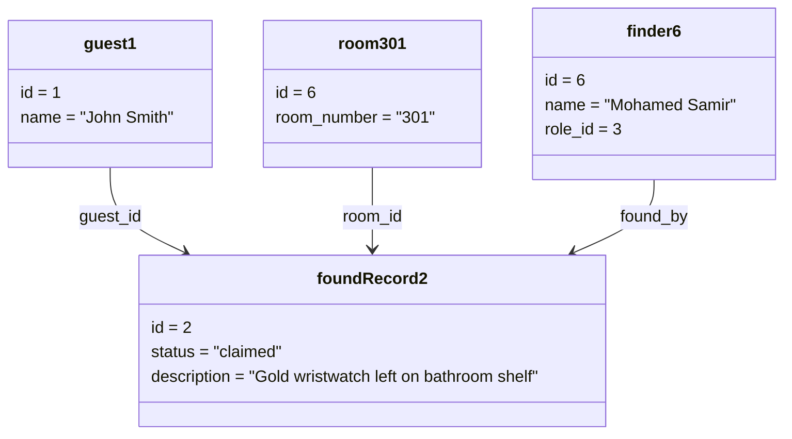

## Role Based User Assignment Scenario
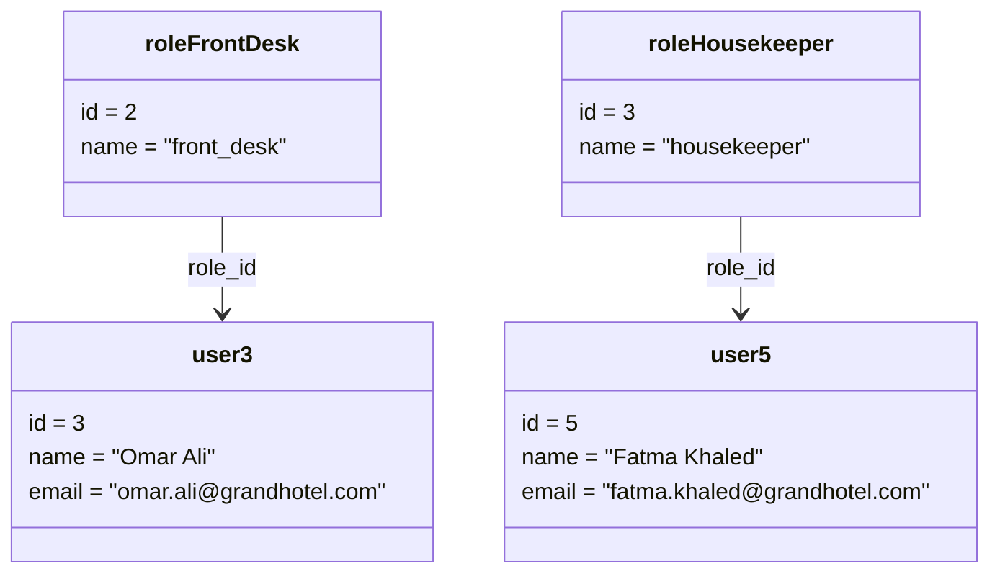

## Virtual Inventory Control Scenario
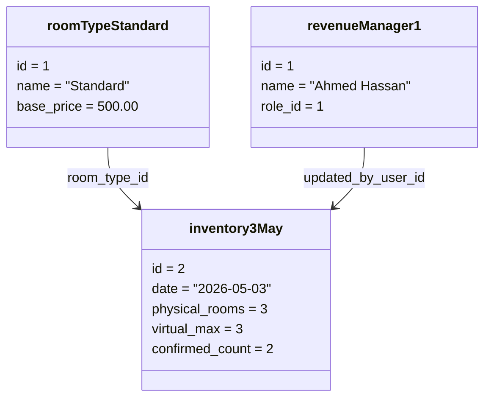
